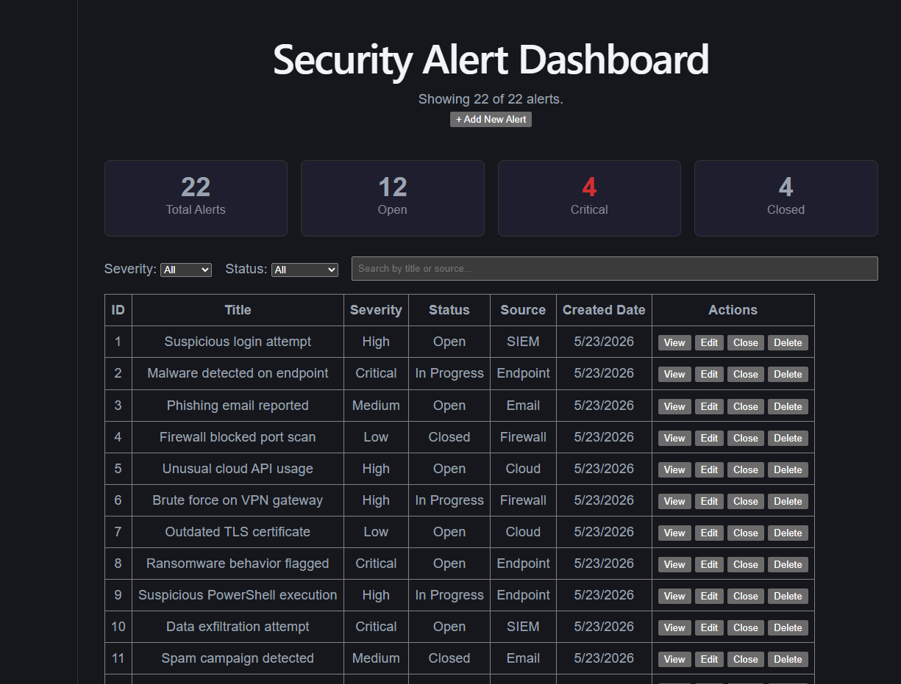
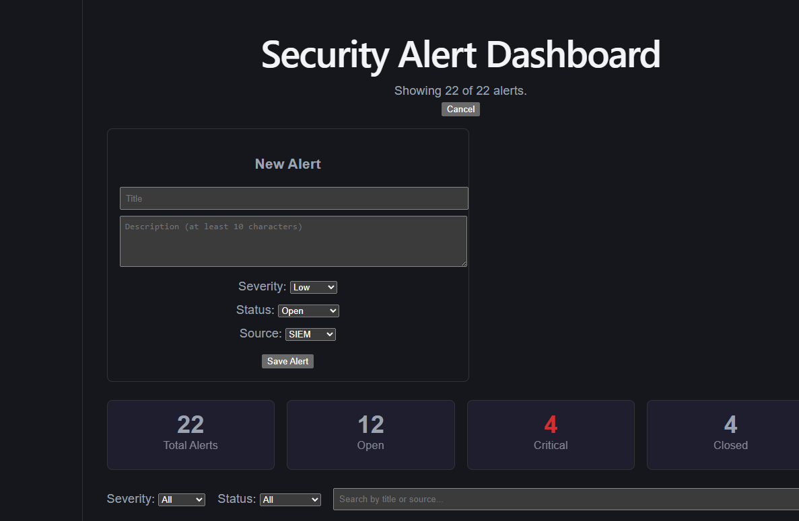
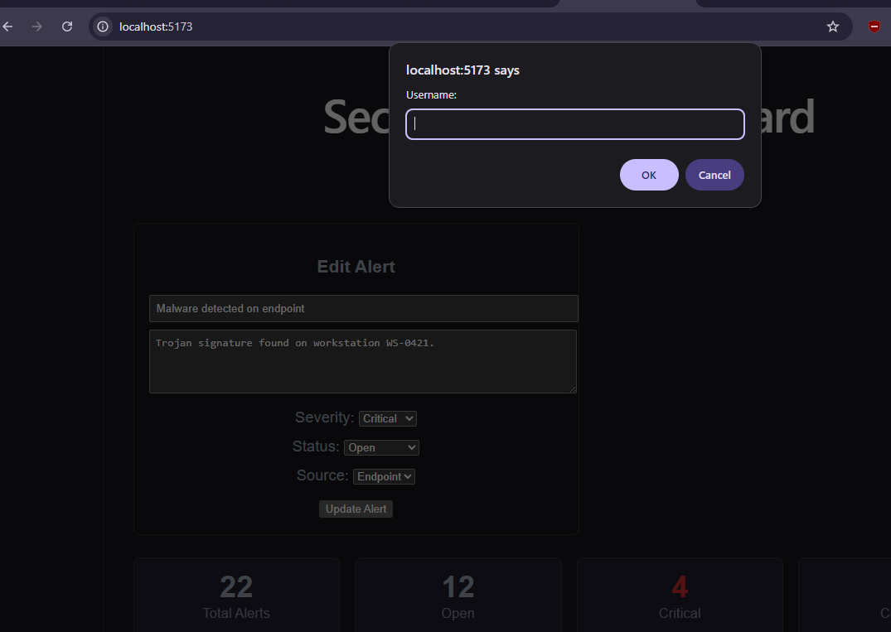
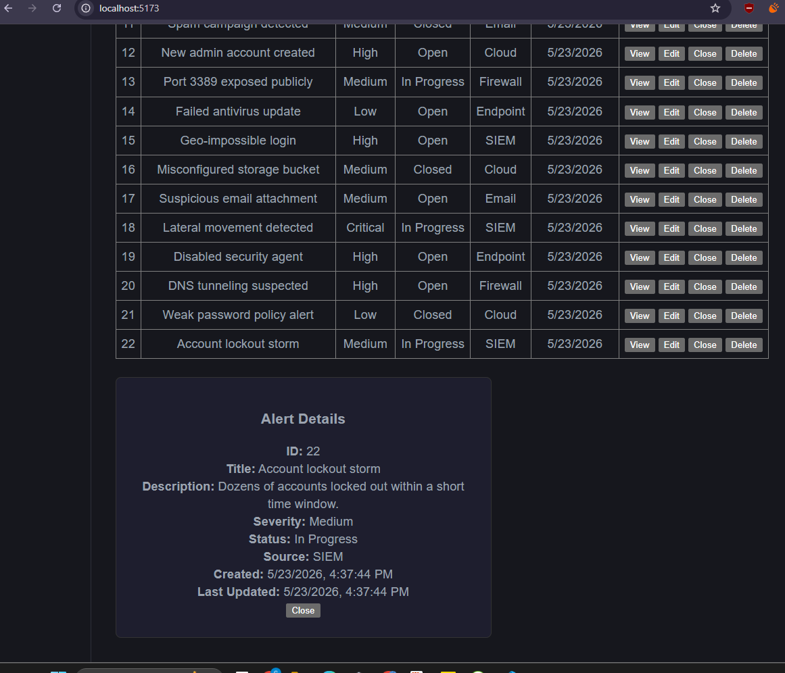
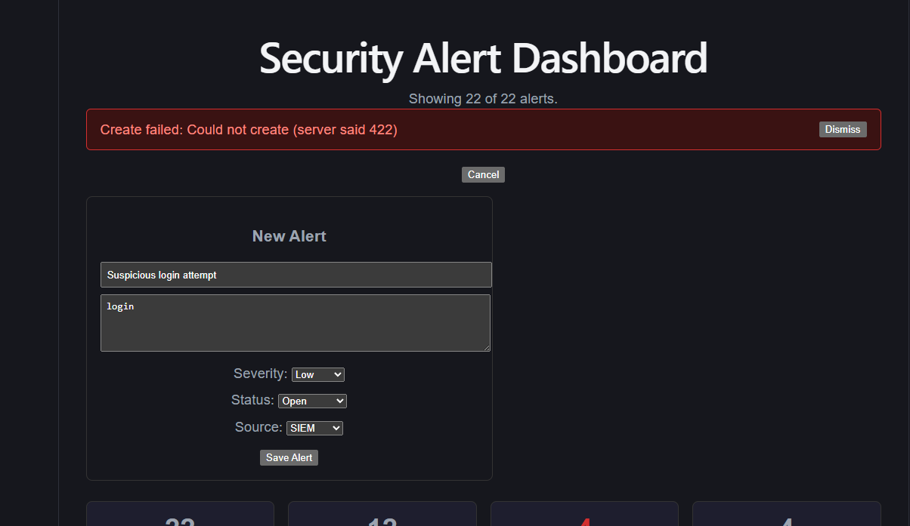
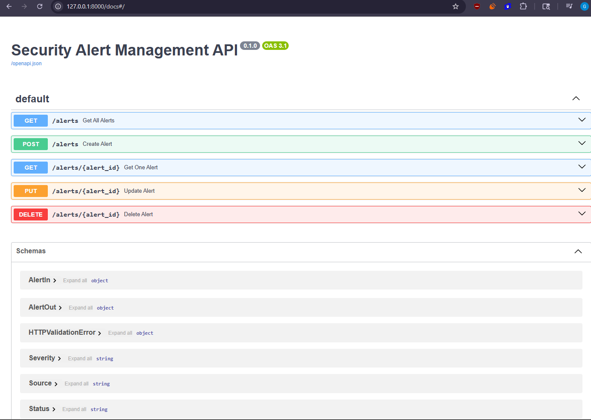

# Security Alert Management Web App

A small full-stack web application for managing security alerts. Users can view, filter, search, create, update, close, and delete alerts through a dashboard backed by a REST API.

Built as a 5-day full-stack take-home assignment.

---

## Tech Stack

| Layer     | Technology                          |
| --------- | ----------------------------------- |
| Backend   | Python 3.12 + FastAPI               |
| Database  | SQLite (via SQLAlchemy ORM)         |
| Frontend  | React (built with Vite)             |
| API docs  | Swagger UI (auto-generated by FastAPI) |

The backend and frontend run as **two separate servers**: the API on `http://127.0.0.1:8000` and the React dashboard on `http://localhost:5173`.

---

## Features

- **Dashboard** with four live summary cards: Total, Open, Critical, and Closed alerts (computed from the data, not hardcoded).
- **Alerts table** showing ID, Title, Severity, Status, Source, Created Date, and action buttons.
- **Filtering** by Severity and Status, plus a live search box matching title or source (case-insensitive). Filters stack; a "Showing X of Y" line reflects the current view.
- **Full CRUD**: create, view details, edit, close (one click sets status to Closed), and delete (with a confirmation prompt).
- **Validation** on the backend: enforced severity/status/source values, non-empty title, and a 10–200 character title / 10–2000 character description range.
- **Friendly error handling**: failed requests surface in a dismissible banner instead of crashing the page.
- **CSV export**: a one-click "Export CSV" button (and `GET /alerts/export` endpoint) downloads all alerts as a spreadsheet-ready file.
- **Request logging**: every API request is logged (method, path, status code, response time) to both the terminal and an `app.log` file.
- **Automated tests**: a `pytest` suite covers all five endpoints plus validation, run against an isolated test database so real data is never touched.

---

## The Alert Model

| Field         | Type     | Notes                                              |
| ------------- | -------- | -------------------------------------------------- |
| `id`          | integer  | Auto-assigned by the database                      |
| `title`       | string   | Required, 10–200 characters                        |
| `description` | string   | Required, 10–2000 characters                       |
| `severity`    | string   | One of: Low, Medium, High, Critical                |
| `status`      | string   | One of: Open, In Progress, Closed                  |
| `source`      | string   | One of: Email, Endpoint, Firewall, Cloud, SIEM     |
| `created_at`  | datetime | Set automatically on creation                      |
| `updated_at`  | datetime | Set automatically; refreshed on every update       |

---

## Project Structure

```
security-alert-app/
├─ database.py          SQLite connection setup (engine, session, Base)
├─ models.py            The Alert table (SQLAlchemy ORM model)
├─ schemas.py           Pydantic validation (enums + field rules)
├─ seed.py              Inserts 22 sample alerts
├─ main.py              FastAPI app: endpoints + CORS + request logging + CSV export
├─ test_main.py         Pytest suite (8 tests: endpoints + validation)
├─ requirements.txt     Pinned Python dependencies
├─ alerts.db            SQLite database file (git-ignored, auto-created)
├─ .gitignore
└─ frontend/            The React app
   ├─ index.html
   ├─ package.json
   ├─ vite.config.js
   └─ src/
      ├─ main.jsx        React entry point
      └─ App.jsx         All dashboard code
```

> `venv/`, `__pycache__/`, `node_modules/`, `*.db`, and `.env` are intentionally excluded from Git.

---

## Setup Instructions

You will run **two terminals** — one for the backend, one for the frontend.

### Prerequisites

- Python 3.12+
- Node.js (LTS) and npm

### 1. Backend (Terminal 1)

From the project root:

```bash
# Create and activate a virtual environment
python -m venv venv

# Windows (PowerShell)
venv\Scripts\Activate.ps1
# macOS / Linux
# source venv/bin/activate

# Install dependencies (pinned versions)
pip install -r requirements.txt

# Seed the database with 22 sample alerts
python seed.py

# Start the API
uvicorn main:app --reload
```

The API now runs at **http://127.0.0.1:8000** and Swagger docs at **http://127.0.0.1:8000/docs**.

### 2. Frontend (Terminal 2)

From the project root:

```bash
cd frontend
npm install
npm run dev
```

The dashboard now runs at **http://localhost:5173**. Open it in your browser — both servers must be running for it to load data.

### 3. Running the Tests (optional)

From the project root, with the virtual environment active:

```bash
pytest -v
```

This runs 8 tests covering all five endpoints and the validation rules. They execute against a separate, throwaway test database, so your seeded `alerts.db` is never modified.

---

## API Documentation

All endpoints are under the base URL `http://127.0.0.1:8000`.

| Method | Endpoint            | Description              | Success | Errors            |
| ------ | ------------------- | ------------------------ | ------- | ----------------- |
| GET    | `/alerts`           | List all alerts          | 200     | —                 |
| GET    | `/alerts/{id}`      | Get one alert by ID      | 200     | 404 (not found)   |
| POST   | `/alerts`           | Create a new alert       | 201     | 422 (validation)  |
| PUT    | `/alerts/{id}`      | Update an existing alert | 200     | 404, 422          |
| DELETE | `/alerts/{id}`      | Delete an alert          | 200     | 404 (not found)   |

Interactive documentation is available at `/docs` (Swagger UI) while the backend is running.

### Sample Requests

**Create an alert (POST):**

```bash
curl -X POST http://127.0.0.1:8000/alerts \
  -H "Content-Type: application/json" \
  -d '{
    "title": "Suspicious login attempt",
    "description": "Multiple failed logins from an unknown IP address",
    "severity": "High",
    "status": "Open",
    "source": "SIEM"
  }'
```

**List all alerts (GET):**

```bash
curl http://127.0.0.1:8000/alerts
```

**Get one alert (GET):**

```bash
curl http://127.0.0.1:8000/alerts/1
```

**Update an alert (PUT):**

```bash
curl -X PUT http://127.0.0.1:8000/alerts/1 \
  -H "Content-Type: application/json" \
  -d '{
    "title": "Suspicious login attempt",
    "description": "Confirmed false positive after investigation",
    "severity": "Low",
    "status": "Closed",
    "source": "SIEM"
  }'
```

**Delete an alert (DELETE):**

```bash
curl -X DELETE http://127.0.0.1:8000/alerts/1
```

---

## Validation Rules

Enforced by Pydantic on the backend (invalid input returns `422` with a clear message):

- `severity` must be one of: Low, Medium, High, Critical
- `status` must be one of: Open, In Progress, Closed
- `source` must be one of: Email, Endpoint, Firewall, Cloud, SIEM
- `title`: required, trimmed, 10–200 characters, cannot be empty
- `description`: required, trimmed, 10–2000 characters

---

## Security Awareness

- **Input validation & sanitization**: all category fields are locked to a fixed set of values; title and description are stripped of surrounding whitespace and length-capped (min and max).
- **XSS protection**: React automatically escapes any text it renders, so a malicious title like `<script>...</script>` displays as harmless literal text rather than executing.
- **Explicit CORS allow-list**: the backend trusts only the two known frontend dev-server origins (`localhost:5173` and `127.0.0.1:5173`) rather than the wildcard `*`.
- **Proper HTTP status codes**: 201 (created), 200 (success), 404 (not found), 422 (validation error).
- **No sensitive data in errors**: the API returns clean messages (e.g. "Alert not found") with no stack traces or database internals exposed.
- **Request logging**: all requests are recorded with method, path, and status, giving a basic audit trail of activity against the API.
- **Authentication on write actions**: create, update, and delete require HTTP Basic login (the browser prompts once per session); read endpoints stay open so the dashboard loads freely. Demo credentials: username `admin`, password `admin123`. Credentials are hardcoded for this assignment; in production they would live in environment variables with a proper user store.

---

## Screenshots

## Screenshots

**Dashboard — summary cards, table, filters, and search**


**Create / edit alert form**


**HTTP Basic authentication — write actions prompt for login**


**Alert details panel**


**Frontend error handling — failed request shows a dismissible banner**


**Swagger API documentation**


---

## Known Limitations

- **Identical seeded dates**: all 22 seeded alerts share the same `created_at` because `seed.py` inserts them in one batch. Alerts created or edited through the app show distinct, correct timestamps.
- **Un-styled details panel & delete confirm**: the View details panel renders below the table, and Delete uses the browser's native confirmation dialog. Both work correctly; converting them into themed modals is deferred polish.
- **No authentication**: write actions are currently open. A simple username/password layer (e.g. HTTP Basic, or token-based auth for production) is a planned future enhancement.
- **SQLite**: chosen for simplicity and zero-config setup; a production deployment would use PostgreSQL.

---

## Future Enhancements

- Dockerfile + docker-compose for one-command setup
- Themed modals for the details panel and delete confirmation
